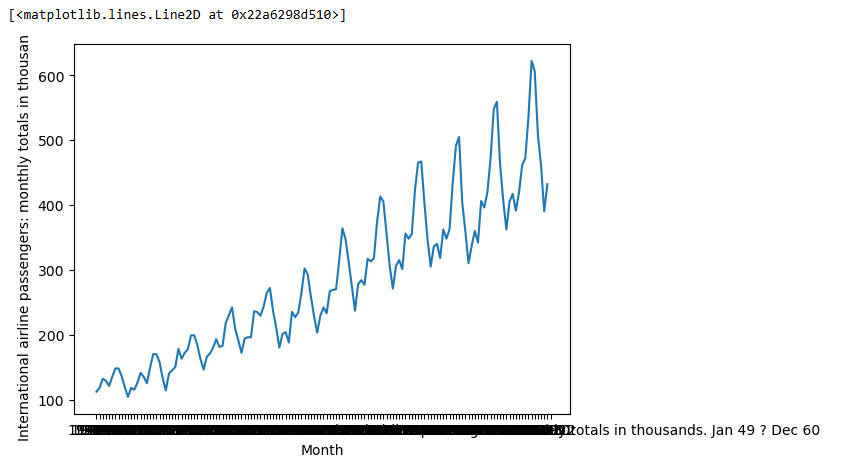
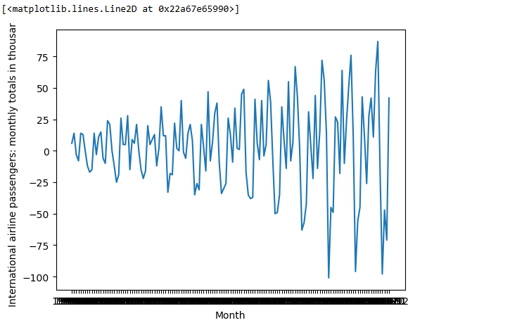
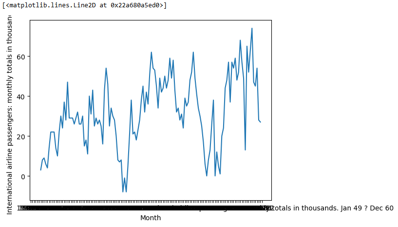
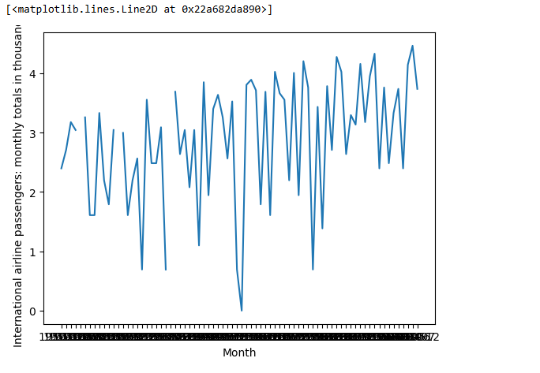

# Ex.No: 1B                     CONVERSION OF NON STATIONARY TO STATIONARY DATA
# Date: 

## AIM:
To perform regular differncing,seasonal adjustment and log transformation on international airline passenger data

## ALGORITHM:
1. Import the required packages like pandas and numpy
2. Read the data using the pandas
3. Perform the data preprocessing if needed and apply regular differncing,seasonal adjustment,log transformation.
4. Plot the data according to need, before and after regular differncing,seasonal adjustment,log transformation.
5. Display the overall results.

## PROGRAM:
```
Name: Sneha Basyal M

Reg no: 212222240101
```

```
#Import the necessary Packages
import pandas as pd
import numpy as np
import matplotlib.pyplot as plt

#Load the dataset
data=pd.read_csv('/content/international-airline-passengers.csv')

#Plot the data without Conversion
x=data['Month']
y=data['International airline passengers: monthly totals in thousands. Jan 49 ? Dec 60']
plt.xlabel('Month')
plt.ylabel('International airline passengers: monthly totals in thousands')
plt.plot(x,y)

#Regular Differencing
data3=data
data3['diff']=data3['International airline passengers: monthly totals in thousands. Jan 49 ? Dec 60'].diff()
data3=data3.dropna()
x=data3['Month']
y=data3['diff']
plt.xlabel('Month')
plt.ylabel('International airline passengers: monthly totals in thousand')
plt.plot(x,y)

#Seasonal Adjustment
data1=data
data1['SeasonalAdjustment'] = data1['International airline passengers: monthly totals in thousands. Jan 49 ? Dec 60'].diff(periods=12)
data1['SeasonalAdjustment'].dropna()
x=data1['Month']
y=data1["SeasonalAdjustment"]
plt.xlabel('Month')
plt.ylabel('International airline passengers: monthly totals in thousands.')
plt.plot(x,y)

#Log Transformation
data2=data
data2['log']=np.log(data2['diff']).dropna()
data2=data2.dropna()
x=data2['Month']
y=data2['log']
plt.xlabel('Month')
plt.ylabel('International airline passengers: monthly totals in thousands.')
plt.plot(x,y)
```

## OUTPUT:

### PLOT WITHOUT CONVERSION


### REGULAR DIFFERENCING:


### SEASONAL ADJUSTMENT:


### LOG TRANSFORMATION:



### RESULT:
Thus we have created the python code for the conversion of non stationary to stationary data on international airline passenger
data.
